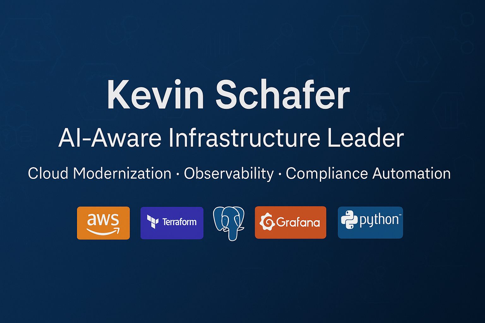

<!-- Top Banner -->

# 👋 Hi, I’m Kevin Schafer

**Director** • AI-Aware Infrastructure Leader • Cloud Modernization • Observability • Compliance Automation  

I lead high-impact infrastructure and data transformations—migrating on-prem to AWS, optimizing costs, automating compliance, and enabling fast, reliable delivery.

---

## 🚀 About Me
- 30+ years across infrastructure, databases, and cloud transformation
- Led hybrid-cloud strategies spanning AWS, Oracle, SQL Server, and PostgreSQL
- Hands-on with modernizing, migrations, DR/BC, cost optimization, and compliance automation
- M&A IT due diligence + post-merger integration experience

---

## 📂 Featured Work
For hands-on projects in **FinOps automation**, **compliance-as-code**, **AI-powered observability**, and **Kubernetes monitoring**, check out my portfolio repo:

➡️ **[Kevin Schafer Infrastructure Portfolio](https://github.com/MAXIMUSK99/kevin-schafer-infra-portfolio)**

---

## 🛠 Tech Stack

**Cloud Platforms**  
  
Amazon RDS • Amazon Aurora • EC2 • S3 • SageMaker • Cost Explorer

**Infrastructure as Code (IaC)**  
  
Jenkins • GitHub Actions

**AI & Automation**  
ChatGPT • GPT-4 • LangChain

**FinOps (Cloud Financial Management)**  
CloudZero • AWS Cost Explorer • Tagging Optimization

**Observability & Monitoring**  
  
Prometheus • ELK Stack • Amazon CloudWatch

**Programming & Scripting Languages**  
  
YAML • HCL

---

## 📜 Certifications
- AWS Certified Solutions Architect – Practitioner

---

## 📊 GitHub Stats

---

## 📫 Let’s Connect
  
📧 kevin.schafer9999\[at\]gmail.com
